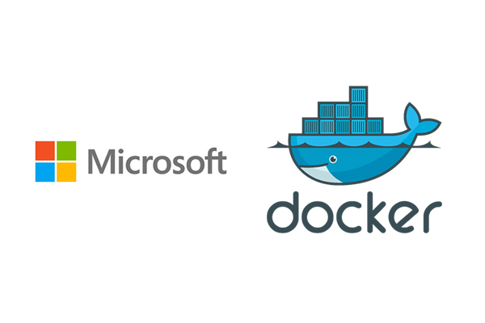

---

## Windows Container Workshop

---

### Agenda

* Containers 101
* Intro to Docker(hands on)
* Run an application in Docker(hands on)
* Why do we an orchestrator?
* Intro to PAS
* Deploy an app to PAS(hands on)
* CI/CD example

@snap[south]
Feel free to interrupt with questions anytime!
@snapend
---
# Containers 101
---
### What is a container?
---
### Types of containers
---
### Why to containers
---
### Docker!
---
# Intro to Docker(On Windows)
---
### Docker Fundamentals

* Docker Host
* Docker Engine
* Docker Image
* Docker Container
* Docker Registry
* Dockerfile

---
### Base images
---
### Working with images
---
### Containers
--- 
### Running a container
---
### Listing containers
---
### Viewing logs
---
### Running interactive containers 
---
### Running containers in the background 
---
### Exec into a container
---
### Leveraging existing containers
---
### Dockerfiles
---
### Cleaning up containers

# Running an Script in Docker
---
### Hello-world.ps1
---
# Running an IIS app
---
### IIS Sample App

